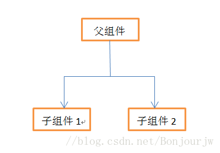
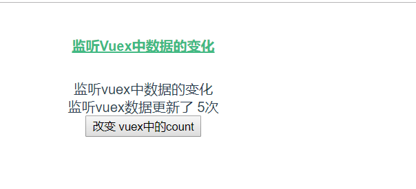
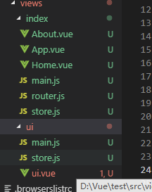
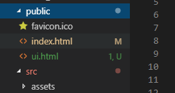

# Vue部分相关的面试题

vue传值‘

1  父  子 传值   使用props接受

2 子 父 传值    父亲写事件函数  子 $emit触发 传值

3 兄弟传值  $bus 中转站  

4 如果组件之间 关系很远 是很多组件都要用的值  **vuex** 

**vuex**   **就是一个全局状态数据管理** 简单来说 他的数据类似全局变量 哪个组件都可以使用

**在项目中使用vuex**

1. 下载 vuex 包 并导入 use一下

   ```
   import Vuex from 'vuex'
   Vue.use(Vuex)
   ```

2. 需要new 一下 写上全局数据

 ```
// store
new Vuex.Store({
  state: {
     count:1 //这个count 就是全局的数据
  },
  mutations: {
  },
  actions: {
  }
})
 ```

3. 需要挂载到new  vue上 

   ```
   new Vue({
     router,
     store,
     render: h => h(App)
   }).$mount('#app')
   ```

**这个步骤是写死的  你可以记一下 下载使用脚手架直接就可以选vuex**


**他的使用逻辑是什么？**

在 store里面的   state  写的数据  是全局数据  所有组件都可以使用 

**使用逻辑**

   **操作全局vuex的 state数据**

   正常情况  必须  dispatch (action)--->action去commit触发 mutation--》mutation里面才能修改state全局数据

​                   action--->mutation--->修改state

   其他情况 你也可以跳过 action  去  直接 commit mutation--》修改state全局数据


## vuex怎么合理规范管理数据,及mutations和actions区别

> 解析: 此题考查 vuex中数据的管理和数据结构的设计,还有mutations 和actions的区别

> **`解答`** : 首先要明确一个特别重要的原则, 就是 不是所有的数据都要放在vuex中, 因为vuex有一句名言:假如你并不知道为什么要使用vuex,那就不要使用它 !
>
>  那么什么样式的数据需要放在vuex中呢 ? 首先这个数据肯定要被多个组件频繁用到, 如果只是被一个组件 用到, 那完全没有任何必要为了使用vuex和使用vuex

举例:  一个网站用户的昵称,账号,资料,像这种系统级别的信息 随时可能在业务中展示,使用, 如果在组件中存储, 那么要获取N次, 所以**`系统级别的数据`**是需要放置在vuex中的, 那么系统级别数据 也不能所以的放置,为了让数据看着更有层级结构感,可以按照像下面这样设计,  

```json
{
    // 系统消息
    system: {
        user: {},
        setting: {}
    }
}
```

> 上面这种结构,一看 便知道我们应该哪里获取系统数据即 设置数据

如果有些业务数据,也需要共享,最好按照模块的具体业务含义分类 , 比如下面

```json
{
    // 系统消息
    system: {
        user: {},
        setting: {}
    },
    product: {
        productList: [], // 商品信息列表
        productOrders: [] // 商品订单啊列表
    }
}
```

> 如上图代码所示,我们很清晰的能够分清楚 每个模块的数据,这样不会导致数据管理的混乱

### mutations和 actions 的区别

> 不同于redux只有一个action, vuex单独拎出了一个mutations,  它认为 更新数据必须是同步的, 也就是只要调用了 提交数据方法, 在mutation里面才可以修改数据
>
> 那么如果我们想做 异步请求,怎么做?  这里 vuex提供了专门做异步请求的模块,action, 当然action中也可以做同步操作, 只不过 分工更加明确, 所有的数据操作 不论是同步还是异步 都可以在action中完成, 
>
> mutation只负责接收状态, 同步完成 **`数据快照`**
>
> 所以可以认为 
>
> state => 负责存储状态 
>
> mutations => 负责同步更新状态
>
> **actions => 负责获取 处理数据（如果有异步操作必须在action处理 再到mutation）**, 提交到mutation进行状态更新

## vuex模块化module管理,使用的时候有注意事项

pro111

> 分析: 此题考查 当vuex维护的数据越来越复杂的时候, 模块化的解决方案
>
> **`解析`**:使用单一的状态树，应用的所有状态都会**`集中在一个比较大的对象`**上面，随着项目需求的不断增加，状态树也会变得越来越臃肿，增加了状态树维护的复杂度,而且代码变得沉长；因此我们需要**`modules(模块化)`**来为我们的状态树**`分隔`**成不同的模块，每个模块拥有自己的state，getters，mutations，actions；而且允许每个module里面嵌套子module；如下：
>
> ```
>  store
>     ├── index.js          # 我们组装模块并导出 store 的地方
>     ├── actions.js        # 根级别的 action
>     ├── mutations.js      # 根级别的 mutation
>     ├── state.js          # 根级别的 state
>     └── modules
>         ├── module1.js   # 模块1的state树
>         └── module2.js   # 模块2的state树
> ```

上面的设计中, 每个vuex子模块都可以定义 state/mutations/actions

> 需要注意的是  我们原来使用**`vuex辅助函数`**  mapMutations/mapActions  引入的是 全局的的mutations 和actions , 并且我们vuex子模块  也就是module1,module2 ... 这些模块的aciton /mutation 也注册了全局, 
>
> 也就是如果 module1 中定义了 loginMutation, module2中也定义了 loginMutation, 此时, mutation就冲突了
>
> 如果重名,就报错了.....
>
> 如果不想冲突, 各个模块管理自己的action 和 mutation ,需要 给我们的子模块一个 属性 **`namespaced: true`**

那么 组件中怎么使用子模块的action 和 mutations

你写一遍 步骤基本是死的 熟悉就好了

```js
// 你可以将模块的空间名称字符串作为第一个参数传递给上述函数，这样所有绑定都会自动将该模块作为上下文
 methods:{
     ...mapMutations('m1', ['loginMutation']),
     add(){
       console.log('add',this)
      //  this.$store.commit("m1/loginMutation")
      // 或者下面的  先mapMutations 相当于帮你写了commit
      // this.loginMutation()
     }
  }

     // 这句话的意思是 直接 解构出 全局 m1模块下的 loginMutation 
    // 把loginMutation 放到this上 并且帮你写好了 commit
    // 相当于帮你简化了代码
     ...mapMutations('m1', ['loginMutation']),
       //不是modules的直接写  ...mapMutations( ['loginMutaton]) 
       
```

> 此题具体考查 Vuex虽然是一个公共状态, 但是公共状态还可以切分成若干个子状态模块, 也就是moduels,
>
> 解决当我们的状态树过于庞大和复杂时的一种解决方案.  但是笔者认为, 一旦用了vuex, 几乎 就认定该项目是较为复杂的

[参考文档](https://vuex.vuejs.org/zh/guide/modules.html)

## 封装Vue组件的步骤

pro111

组件是什么？组件是一段功能代码  ---大白话 就是一段html +js +css   你可以重复使用

封装轮播图 -  1 新建vue组件 2 Vue.component注册组件 3  在其他组件使用 标签名


参数： 可以传入数据 使用props接受 比如 数组 定时器时间等

> 分析: 本题考查 对于Vue组件化开发的熟练程度
>
> **`解析`**: 首先明确 组件是本质是什么?  
>
> 组件就是一个单位的HTML结构 + 数据逻辑 + 样式的 操作单元 
>
> Vue的组件 继承自Vue对象, Vue对象中的所有的属性和方法,组件可自动继承. 
>
> 组件的要素  template  =>  作为页面的模板结构 
>
> script  => 作为数据及逻辑的部分
>
> style  => 作为该组件部分的样式部分

要封装一个组件,首先要明确该组件要做的具体业务和需求,  什么样的体验特征, 完成什么样的交互, 处理什么样的数据

> 明确上述要求之后, 着手模板的结构设计及搭建,也就是 常说的html结构部分,  先完成 静态的html结构
>
> 结构完成, 着手数据结构的设计及开发, 数据结构一般存储于组件的data属性 或者 vuex 状态共享的数据结构
>
> 数据设计完成/ 结构完成  接下来 完成数据和模块的结合 , 利用vuejs中指令和 插值表达式的特性 将静态结构 **`动态化`**
>
> 展现的部分完成, 接下来完成**`交互部分`**,即利用 组件的生命周期的钩子函数 和 事件驱动 来完成 逻辑及数据的处理与操作

最后组件完成,进行测试及使用

常用的组件属性 => data/ methods/filters/ components/watch/created/mounted/beforeDestroy/computed/props

常用组件指令: v-if/v-on/v-bind/v-model/v-text/v-once

## Vue中的data是以函数的形式还是对象的形式表示

> 分析: 此题考查 data的存在形式

> **`解析`**: 我们在初步学习Vue实例化的时候写的代码时这个样子
>
> ```js
> new Vue({
>     el: '#app',
>     data: {
>         name: 'hello world'
>     }
> })
> ```
>
> 上面代码中的data 是一个对象, 但是我们在开发组件的时候要求data必须是一个带返回值的函数

```js
export default {
    data () {
        return {
            name: '张三'
        }
    }
}
```

> 为什么组件要求必须是带返回值的函数?  因为 我们的组件在实例化的时候, 会直接将data数据作用在视图上, 
>
> 对组件实例化, 会导致我们组件的data数据进行共享, 好比  现在有两辆新车, 你一踩油门, 不光你的车往前车,另辆车也和你一样往前冲!   这显然不符合我们的程序设计要求, 我们希望组件内部的数据是相互独立的,且互不响应,所以 采用   **`return {}`**  每个组件实例都返回新对象实例的形式,保证每个组件实例的唯一性

## 使用Proxy代理跨域

pro111

什么是跨域？

  域名 协议 ip地址 端口 任何一个不一样 就跨域

解决跨域？

   1 jsonp   ---使用script的src发送   只能get 请求

   2 cors 后台设置允许跨域    **需要后台设置** 允许跨域

​      所有后台语言 都可以设置       

   3  服务器代理

**重点 现在 前端 vue 框架 是可以自己设置 服务器代理的**  proxy

​         **配置就行**

  **vue在 vue.config.js  可以配置重写webpack**


>分析: 本题考查如何解决跨域问题
>
>解析: 解决跨域问题的方式有几种,
>
>**1 一种是服务端设置**  , 但这种方式依赖服务端的设置,在前后分离的场景下 ,不太方便
>
>```
>Access-Control-Allow-Origin：*
>Access-Control-Allow-Methods："POST, GET, OPTIONS, DELETE"
>```
>
>**2 还有一种jsonp形式**, 可以利用script标签 的特性解决同源策略带来的跨域问题,但这是这种方案对于请求的类型有限制,只能get
>
>**3 还有一种就可以在开发环境(本地调试)期间,进行代理**, 说白了 就是通过 在本地通过nodejs 启动一个微型服务, 
>
>然后我们先请求我们的微型服务, 微型服务是服务端, 服务端**`代我们`**去请求我们想要的跨域地址, 因为服务端是不受**`同源策略`**的限制的, 具体到开发中,打包工具webpack集成了代理的功能,可以采用配置webpack的方式进行解决, 但是这种仅限于 本地开发期间, **等项目上线时,还是需要另择代理 nginx**

以下为webpack配置代理的配置 

```json

// vue.config.js
module.exports = {
  // 修改的配置
  devServer: {
      proxy: {
          '/api': {
              target: 'http://122.51.238.153',
              changeOrigin: true,
              pathRewrite: {
                '^/api': ''
              }
          }
      }
  }
}
```

**`target`**：接口域名；

 **`changeOrigin`**： 如果设置为`true`,那么本地会虚拟一个服务端接收你的请求并代你发送该请求；

 **`pathRewrite`**：如果接口中是没有api的，那就直接置空（如上）如果接口中有api，就需要写成{‘^/api’:‘’}

**上线了如果还有跨域 可以让后台设置 允许跨域**

## Vue中的watch如何深度监听某个对象

> 分析: 此题考查Vue的选项watch的应用方式
>
> 解析:  watch最基本的用法是 
>
> ```js
> export default {
>     data () {
>         return {
>             name: '张三'
>         }
>     },
>     watch: {
>         // name 函数 是对应那个数据名字
>         name (newValue, oldValue) {
>             
>         }
>     }
> }
> ```
>
> 上面代码中: 有个原则监听谁,写谁的名字,然后是对应的执行函数, 第一个参数为最新的改变值,第二个值为上一次改变的值, 注意: 除了监听 data,也可以监听**`计算属性`** 或者一个 函数的计算结果
>
> 那怎么深度监听对象 ,两种方式
>
> 1. 字符串嵌套方式
>
> ```js
> export default {
>     data () {
>         return {
>            a: {
>                b: {
>                    c :'张三'
>                }
>            }
>         }
>     },
>     watch: {
>         //想监听 c  此时 数据 是 a.b.c  比较深   深度监听
>         "a.b.c": function (newValue, oldValue) {
>             
>         }
>     }
> }
> ```
>
> 2. 启用深度监听方式
>
>    ```js
>    export default {
>        data () {
>            return {
>               a: {
>                   b: {
>                       c :'张三'
>                   }
>               }
>            }
>        },
>        watch: {
>            a: {
>                deep: true // deep 为true  意味着开启了深度监听 a对象里面任何数据变化都会触发handler函数,
>                handler(){
>                   // handler是一个固定写法
>                }
>            }
>        }
>    }
>    ```

## Vue keep-alive使用

pro111

> 分析: 此题考查Vue中组件缓存的使用 
>
>  **keep-alive  vue原生自带  用来缓存组件的** 
>
> 解析:  keep-alive是 Vue提供的一个全局组件, Vue的组件是有销毁机制的,比如条件渲染, 路由跳转时 组件都会经历**`销毁`**, 再次回到页面时,又会回到 **`重生`**, 这一过程保证了生命周期钩子函数各个过程都会在这一生命周期中执行.
>
> 但是,我们辛辛苦苦获取的数据 滑动的页面 会因为组件的销毁 重生 而 **`归零`**,这影响了交互的体验, 所以 keep-alvie出现了, 可以帮助我们缓存想要缓存的组件实例, 只用用keep-alive **`包裹`**你想要缓存的组件实例, 这个时候, 组件创建之后,就不会再进行 销毁, 组件数据和状态得以保存
>
> 但是,没有了销毁,也就失去了重生的环节, 我们失去了 原有的钩子函数, 所以keep-alive包裹的组件 都获取了另外**两个事件 --如果缓存组件需要重新获取数据**
>
> 唤醒 activated重新唤醒休眠组件实例时 执行
>
> 休眠 deactivated组件实例进入休眠状态时执行

但是我们不能缓存所有的组件实例, 如果是针对 组件容器 router-view 这个组件进行的缓存, 一般的策略是在路由的元信息 meta对象中设置是否缓存的标记,  然后根据标记决定是否进行缓存

```js
  <div id="app">
    <keep-alive>
      <!-- 里面是当需要缓存时   显示组件的 router-view-->
      <router-view  v-if="$route.meta.isAlive" />
    </keep-alive>
     <!-- 外面是不需要缓存时 -->
    <router-view  v-if="!$route.meta.isAlive" />
  </div>
```

还有需要注意的问题是:  被缓存的组件中如果还有子组件, 那么子组件也会一并拥有 激活和唤醒事件,并且这些事件会在同时执行

## vue的双向数据绑定原理是什么

pro111

> 分析 :此题考查 Vue的MVVM原理
>
> **`解答`**:  Vue的双向绑定原理其实就是MVVM的实现原理, Vuejs官网已经说明, 实际就是通过 Object.defineProperty方法 完成了对于Vue实例中数据的 **`劫持`**, 通过对于 data中数据 set的监听,
>
> 然后通过**`观察者模式`**, 通知 对应的绑定节点 进行节点数据更新, 完成数据驱动视图的更新
>
> 同理, 通过对于节点的表单值改变事件的监听,  执行对于数据的修改

简单概述 : 通过Object.defineProperty 完成对于数据的劫持, 通过观察者模式, 完成对于节点的数据更新


## 页面刷新了之后vuex中的数据消失怎么解决

>分析:此题考查 如果将vuex数据进行本地持久化
>
>**`解析`**: vuex数据位于内存, 页面的刷新重置会导致数据的**`归零`**,也就是所谓的消失,  本地持久化可以解决这个问题.本地持久化用到的技术也就是 本次存储 sesstionStorage 或者 localStorage ,  
>
>如果需要保持的更长久 ,浏览器关掉 再打开依然存有数据,需要使用后者 
>
>实施方案:  state的持久化 也就是分别需要在 state数据初始化 /更新 的时候 进行读取和设置本地存储操作
>
>代码如下 
>
>```js
>export default new Vuex.store({
>    state: {
>        user: localStorge.getItem('user')  // 初始化时读取 本地存储
>    },
>    mutations: {
>        updateUser (state, payload) {
>            state.user = payload.user
>            localStoregae.setItem('user',payload.user) // 数据更新时 设置本地存储
>        }
>    }
>})
>```
>
>

## vue做服务端渲染

pronuxt

[nuxt官网文档](https://zh.nuxtjs.org/guide/installation/)

nuxt.js    vue语法版本的  服务器渲染(ssr) 框架 

> 分析: 为什么要做服务端渲染, 首先要明白 服务端渲染解决什么问题
>
> **`解析`**: vuejs 官网说的很明白, 要做服务端渲染首先必须是有对应的需求,即对 实时到达时间(页面访问时间)的绝对需求.  如果只是简单的一个管理系统, 区区几百毫秒的优化 显得十分小题大做.
>
> 服务端渲染这里 有一个成熟优秀的框架 nuxt.js , 正如next.js对于react,nuxt是vue服务端渲染的优秀解决方案

> nuxt的出现可以让渲染内容完全服务端化,解决seo不够友好, 首屏渲染速度不够迅速的问题,
>
> 但是这里需要注意: 并不是所有页面都需要服务端渲染, 因为服务端渲染比重多大 对于服务器的访问处理能力 要求也会急剧增大

```
步骤  这个 nuxt 脚手架 不需要 安装  nodejs 默认自带了
  1 脚手架 npx create-nuxt-app <项目名>
  2 进入项目 yarn dev 启动开发
  
  上线 
  yarn build
  yarn start
```

##### 为什么使用nuxt.js?   了解 你下去创建一个 写一下

**普通vue项目  打开地址查看源代码   是空**  他主要是用切换的时候才会有内容

**nuxt.js项目  查看源代码 他是已经渲染好了很多html了**


1 这个和seo 搜索引擎 比如百度 他会去 找到所有网站 挨个看你的网站内容 有没有 好不好--爬虫

如果普通vue  项目 是 空的  那么 就没有内容  seo不行 网站就很垃圾

如果nuxt.js项目  有内容  就比较好 利于seo

2  普通vue项目  内容打包到js了  那个js会很大  首页就显示很慢

如果nuxt.js项目  只是一些 js 其他的他服务器端就渲染好了   稍微快


vue单页面应用渲染是从服务器获取所需js，在客户端将其解析生成html挂载于

id为app的DOM元素上，这样会存在两大问题。

1. 由于资源请求量大，造成网站首屏加载缓慢，不利于用户体验。
2. 由于页面内容通过js插入，对于内容性网站来说，搜索引擎无法抓取网站内容，不利于SEO。
   Nuxt.js 是一个基于Vue.js的通用应用框架，预设了利用Vue.js开发服务端渲染的应用所需要的各种配置。可以将html在服务端渲染，合成完整的html文件再输出到浏览器。

**除此之外，nuxt与vue还有一些其他方面的区别。**

1. **路由**
   nuxt按照 pages 文件夹的目录结构自动生成路由

   <http://localhost:3000/user/reg>  相当于 去访问  pages文件夹 下的  user文件夹 下的 reg.vue

   vue需在 src/router/index.js 手动配置路由

2. **入口页面**
   nuxt页面入口为 layouts/default.vue
   vue页面入口为 src/App.vue

3.  nuxt 类似  router-view   nuxt-link  类似 router-link


1. **webpack配置**
   nuxt内置webpack，允许根据服务端需求，在 nuxt.config.js 中的build属性自定义构建webpack的配置，覆盖默认配置
   vue关于webpack的配置存放在build文件夹下

2. **asyncData 里面发送ajax 这个东西跟生命周期这些都是平级的**

  要理解asyncData方法执行时，其实是在服务端完成的，这个数据是在服务端渲染好了的 

  ​

  ```
  unxtjs的ajax，你先别往你那个异步上去思考，其实这里面所有的ajax最后都会形成页面。你别想着，我一点按钮，调用一个方法，然后再ajax去加载数据。因为我们最后全部都会生成静态，所以任何的获取数据的操作，最后都会变成页面的跳转。
  ```

所以，官方给了一套写法，你必须按照这个去写，
并且这里的ajax会再页面渲染之前就执行。这个东西跟生命周期这些都是平级的。


1 cnpm install @nuxtjs/axios --save
2 .plugins目录新建axios.js

```
import * as axios from 'axios'

let options ={}

//需要全路径才能工作

if(process.server){

　　options.baseURL=http://${process.env.HOST || 'localhost'}:${process.env.PORT || 3000}/api

}

export default axios.create(options)
```


3.Nuxt.config.js增加axios配置

 

```
modules:[

　　'@nuxtjs/axios'

],
```


4 使用 asyncData 里面发送ajax 这个东西跟生命周期这些都是平级的 在页面渲染之前

```
export default {

  async asyncData({app}){

　　        let res =await app.$axios({

              　　headers: { 'Content-Type': 'application/x-www-form-urlencoded' },
              　　method: 'get',
              　　url: `http://test.yms.cn/testjson.asp`,
              　　data: ''
    
        　　})
        // app.$axios
        　　console.log('res',res.data)
        　　return{
        　      　testData:res.data.title
        　　}
    },
    created(){
      console.log('nuxt reg组件')
      
    }

}
```

下图为关于nuxt的简单概述


## vue-router传参

> 分析:考查vue-router的传值方式
>
> **`解析`**  vue-router 传值 可以通过 地址传值
>
> 最简单的就是url传值, url传值又两种, params 和 query参数传值
>
> params传值 是指的动态路由传值 
>
> ```vue
> {  path: '/user/:id' }  // 定义一个路由参数
> <router-link to="/user/123"></router-link>  // 传值
> /user/123
> '/user/:id'  ---123 就是 id
> this.$route.params.id   // 取值 专门获取 :id 这种参数 params 参数 
> ```
>
> query传值,指通过?后面的拼接参数传值
>
> ```vue
> {  path: '/user' }  // 定义一个路由参数
> <router-link to="/user?id=123&name=zs"></router-link>  // 传值
> this.$route.query.id   // 取值 获取 ?后面的参数 query参数 查询字符
> this.$route.query.name  --- zs
> ```


## 前端鉴权一般思路

以前讲过  我们可以 在axios的  请求拦截器 里面 配置 token  

**1 有些axios请求 需要token  我们 是可以 配置请求拦截器**

**2 有些页面 需要登录才能看  我们也可以用路由导航守卫 router.beforeEach  判断 token**

3 新情况？侧边栏 有很多 那么 后台侧边栏 有不同的人登录 难道我们要 每个人都可以看全部侧边栏吗？

​    比如 总经理 看的侧边栏很多 权限大 能操作很多页面

​             普通员工  就只能看两个侧边栏 因为他的权限低

**这个时候就涉及到  如果不同的人登录 权限职位不一样  应该给他展示 不同的侧边栏**

这个时候 侧边栏 一般是路由相关的页面  是需要循环生成的

不同的人 路由数组不一样  那么 循环生成的侧边栏 就不一样了

这样就可以控制侧边栏 显示

思路是  在公司会这样干？ 

>分析: 考查前后分离的鉴权思路

**`解析`**: 首先要明白 为什么要在前端鉴权? 因为传统项目都是在后端鉴权, 然后通过进行拦截 跳转 对应操作

因为 我们做的并不是传统的项目,而是前后分离项目,也就是前端项目和后端服务进行了**`剥离`**, 后端没有办法用session来存储你任意一个前端项目域名下的身份信息, 所以jwt 鉴权模式应运而生. 

​    也就是后端不再提供会话的身份存储,而是通过一个鉴权接口将用户的身份,登录时间,请求端口,协议头..等等信息 组装成一个加密的串 返给前端请求,  前端拿到了这个串,就可以认为自己登录成功

那么这个**`加密串`**就成了 前端用户是否登录的成功标志, 这就是我们的token , 那么在接下来的接口请求中,我们几乎都要携带这个加密串,因为它是**`唯一`**能**`证明我们身份`**的信息.

为了方便,我们会一般在请求工具 axios(举例)的拦截器中**`统一注入token`**, 减少代码的重复

token 同时具有时效性,我们也需要在此时对token过期进行处理,一旦出现过期的请求码, 就需要进行 换取新token 或者重新登录的解决方案

除此之外,我们还需要依据**`有无加密串`** 在前端对于某些页面的访问进行限制, 这个会用到我们的Vue-Router中的导航守卫.

**vue 单页项目涉及到多角色用户权限问题，不同的角色用户拥有不同的功能权限， 不同的功能权限对应的不同的页面**

一开始 有一些 默认的路由

登录后 比如你是总经理  后台会返回给前端 总经理能看见的 路由页面地址 数组 

前端在router.beforeEach 路由导航守卫里面 拿到返回的地址  使用 **router.addRouter** 动态加上 这个项目路由就好了

routes= 后台返回的 符合条件的 路由数据 类似我们自己写的那个path 等等
this.$router.addRoutes(routes)

       例子

    // 路由导航守卫
    router.beforeEach((to, from, next) => {
      　　　　//判断user信息是否已经获取 我已经登录了
              // 登录后就 把 后台给我的路由数组 addRouter就行
              if (token) {
      　　　　　　　　//根据用户的角色类型来生成对应的新路由
                  //  在这里要用 登录时候后台返回的 路由数组
                  // 建议大家 把那个数组 写在 vuex里面
                  // 从vuex 拿出 登录时候存的 newRouter
                  // 1 你提前写好 会有所有人能看的 一些 默认的路由
                  // 2 不同的 登录后  对应的路由 再追加
                  // this.$store.state.newRouter
                  // const newRouter = [{path:"/xxx" ...} ..]
                  //将新路由添加到路由中
                  // router.addRoutes vue带的专门用来追加路由的
                  //　router.addRoutes(newRouter)
      　　　　　　　//为了正确渲染导航,将对应的新的路由添加到vuex中
                   // 渲染对应的侧边栏
              }
    })


### 如果只是前端  怎么做？  

  如果是**前端 就 先写一个  全的  所有的  路由数组**

   登录之后 后台 返回  当前的登录人的 数据 比如 路由列表或者这个人的权限 

 前端 拿到路由列表 去循环 和你那个全的 路由 对比  拿到相关的  在addRouter添加 就行

## vue数据流 和 react数据流  ---单独的概念 数据流

面试问 vue数据流  他不是问你双向绑定 你应该说

**vue  react 数据流 是单向 的   父-->  子  vue还有一个概念 是 v-model** 

在**vue** **React**中**数据流**向是**单向**的，**由父节点流向子节点**，如果父节点的props发生了改变，那么React会递归遍历整个组件

**父组件通过绑定 props 的方式，将数据传递给子组件，但是子组件自己并没有权利修改这些数据，如果要修改，只能把修改这一个行为通过 event 的方式报告给父组件，由父组件本身决定改如何处理数据。**



**vue 另一个概念 v-model双向数据   无论数据改变，或是用户操作，都能带来互相的变动，自动更新。**

v-model 一般用在 表单元素  核心 是 他帮助我们  绑定value  + oniput 文本框值改变的事件

## 如何在组件中监听Vuex的数据变化

> 分析:   此题考查Vuex的应用及 Vue内部的监听数据变化的机制  

> **`解答`**:  首先确定 Vuex是为了解决什么问题而出现的 ?  Vuex是为了解决组件间状态共享而出现的一个框架.
>
> 其中有几个要素 是组成Vuex的关键,  state(状态)  mutations  actions  ,
>
> state 表示 需要共享的状态数据
>
> mutations  表示 更改 state的方法集合  只能是同步更新 不能写ajax等异步请求
>
> actions  如果需要做异步请求  可以在actions中发起 然后提交给 mutations mutation再做同步更新

也就是 state 负责管理状态 ,  mutation负责同步更新状态 action负责 异步获取数据 同提交给mutation

> 所以 组件监听Vuex数据变化 就是 监听 Vuex中state的变化, 

**`第一种方案`**  我们可以在组件中通过组件的 **watch方法来做**, 因为组件可以将state数据映射到 组件的计算属性上,

然后 监听 映射的计算属性即可 代码如下

```js
// vuex中的state数据
  state: {
    count: 0
  },
     
//  A组件中映射 state数据到计算属性
  computed: {
   //  this.$store.state.count
  // mapState       把全局  count 变成 可以直接使用的 数据
    ...mapState(['count'])
  }
// A组件监听 count计算属性的变化
   watch: {
     // watch 可以监听 data 数据 也可以监听 全局 vuex数据
    count () {
      // 用本身的数据进行一下计数
      this.changeCount++
    }
  }
```



**`第二种方案`**   vuex中store对象本身提供了**`watch`**函数 ,可以利用该函数进行监听

- **watch(fn: Function, callback: Function, options?: Object): Function**

响应式地侦听 `fn` 的返回值，当值改变时调用回调函数。`fn` 接收 store 的 state 作为第一个参数，其 getter 作为第二个参数。最后接收一个可选的对象参数表示 Vue 的 [`vm.$watch`](https://cn.vuejs.org/v2/api/#vm-watch) 方法的参数。

代码

```js
  created () {
    this.$store.watch((state, getters) => {
      return state.count
    }, () => {
      this.changeCount++
    })
  }
```

> 以上代码 均在示例有体现

## Vue单页面和多页面的使用

配置多入口文件

Vue单页面  只有一个页面 index.html 在里面 切换不同的组件

我想配置多页面？ 有多个页面  写死的步骤  只需要 配置 vue.config.js和对应好文件夹 就行

morepage

<>

> 分析: 首先分析,单页面应用和 多页面应用的根本区别 
>
> **`解答`**:  单页面即所有的模块统统置于一个html文件之上,切换模块,不会重新对html文件和资源进行再次请求,服务器不会对我们**`换页面`**的动作 产生任何反应, 所以我们感觉不到任何的刷新动作,速度和体验很畅快
>
> 多页面应用 即多个html页面 共同的使用, 可以认为一个页面即一个模块,但是不排除 多个单页应用混合到一起的组合情况 ,  多页面切换一定会造成 页面资源的重新加载, 这也就意味着 如果 多页面之间切换,一定会造成很数据的**`重置`**
>
> 一个项目分成很多 小vue项目 你去其实也可以直接创建两个项目	

1 **新建多个页面  每个页面是一个单独的小vue类型 **




2  配置 多入口页面**在vue.config.js里写上这些** 重点是入口选择对应页面的main.js

```
//vue.config.js
module.exports = {
  pages: {
    index: {
      // page 的入口
      entry: "src/views/index/main.js",
      // 模板来源
      template: "public/index.html",
      // 在 dist/index.html 的输出
      filename: "index.html",
      // 当使用 title 选项时，
      // template 中的 title 标签需要是 <title><%= htmlWebpackPlugin.options.title %></title>
      title: "Index Page"
    },
    ui: {
      // page 的入口
      entry: "src/views/ui/main.js",
      // 模板来源
      template: "public/ui.html",
      // 在 dist/ui.html 的输出
      filename: "ui.html",
      // 当使用 title 选项时，
      // template 中的 title 标签需要是 <title><%= htmlWebpackPlugin.options.title %></title>
      title: "ui Page"
    }
  }
};
```

3 public  写上不同的渲染的  html



4  main.js 不同的入口 对应上自己的 根组件和 页面元素

5  通过a标签跳转

```
<div id="app">
    ui页面啊啊啊
    <a href="home.html">去home页面</a>
  </div>
```

