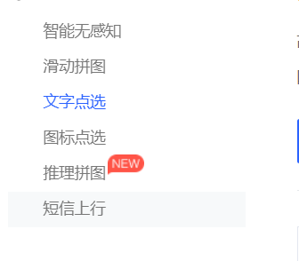
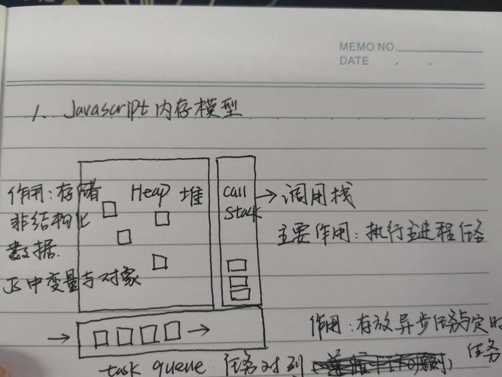
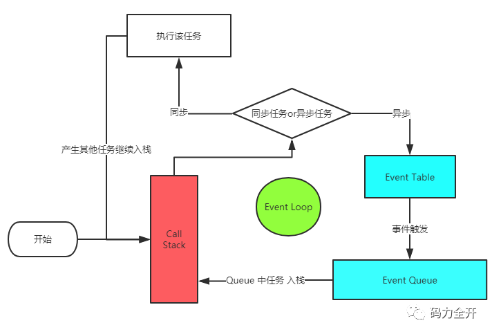

# 前端学科面试题

### 1：HTML页面进行重绘和重排(回流)

#### 1.1 问题分析

​	该问题主要考核  html中的优化 与 重点概念

#### 1.2 核心问题讲解

##### **浏览器的运行机制：**

1. 构建DOM树（parse）：渲染引擎解析HTML文档，首先将标签转换成DOM树中的DOM node（包括js生成的标签）**生成内容树**（Content Tree/DOM Tree）；
2. 构建渲染树（construct）：解析对应的CSS样式文件信息（包括js生成的样式和外部css文件），而这些文件信息以及HTML中可见的指令（如<b></b>）**，构建渲染树**（Rendering Tree/Frame Tree）；render tree中每个NODE都有自己的style，而且render tree不包含隐藏的节点(比如display:none的节点，还有head节点)，因为这些节点不会用于呈现
3. 布局渲染树（reflow/layout）：从根节点递归调用，计算每一个元素的大小、位置等，给出每个节点所应该在屏幕上出现的精确坐标；
4. 绘制渲染树（paint/repaint）：遍历渲染树，使用UI 层来绘制每个节点。

**重绘（repaint或redraw）**：

​	当盒子的位置、大小以及其他属性，例如颜色、字体大小等都确定下来之后，浏览器便把这些原色都按照各自的特性绘制一遍，将内容呈现在页面上。

**重绘是指一个元素外观的改变**所触发的浏览器行为，浏览器会根据元素的新属性重新绘制，使元素呈现新的外观。

 　　**触发重绘的条件：改变元素外观属性。如：color，background-color等。******

**注意：**table及其内部元素可能需要多次计算才能确定好其在渲染树中节点的属性值，比同等元素要多花两倍时间，这就是我们尽量避免使用table布局页面的原因之一。

**重排（重构/回流/reflow）：**当渲染树中的一部分(或全部)因为元素的**规模尺寸，布局，隐藏等改变而需要重新构建, 这就称为回流(reflow)**。每个页面至少需要一次回流，就是在页面第一次加载的时候。

**重绘和重排的关系**：在回流的时候，浏览器会使渲染树中受到影响的部分失效，并重新构造这部分渲染树，完成回流后，浏览器会重新绘制受影响的部分到屏幕中，该过程称为重绘。

　　　　　　　　　　所以，**重排必定会引发重绘**，但重绘不一定会引发重排。

 　　**触发重排的条件：任何页面布局和几何属性的改变都会触发重排，比如：**

　　1、页面渲染初始化；(无法避免)

　　2、添加或删除可见的DOM元素；

　　3、元素位置的改变，或者使用动画；

　　4、元素尺寸的改变——大小，外边距，边框；

　　5、浏览器窗口尺寸的变化（resize事件发生时）；

　　6、填充内容的改变，比如文本的改变或图片大小改变而引起的计算值宽度和高度的改变；

　　7、读取某些元素属性：（offsetLeft/Top/Height/Width,　clientTop/Left/Width/Height,　scrollTop/Left/Width/Height,　width/height,　getComputedStyle(),　currentStyle(IE)　)

**重绘重排的代价：耗时，导致浏览器卡慢。******

#### 1.3 问题扩展

**优化：**　　

1、浏览器自己的优化：浏览器会维护1个队列，把所有会引起回流、重绘的操作放入这个队列，等队列中的操作到了一定的数量或者到了一定的时间间隔，浏览器就会flush队列，进行一个批处理。这样就会让多次的回流、重绘变成一次回流重绘。

2、我们要注意的优化：我们要减少重绘和重排就是要减少对渲染树的操作，则我们可以合并多次的DOM和样式的修改。并减少对style样式的请求。

（1）**直接改变元素的className**

（2）display：none；先设置元素为display：none；然后进行页面布局等操作；设置完成后将元素设置为display：block；这样的话就只引发两次重绘和重排；

（3）使用cloneNode(true or false) 和 replaceChild 技术，引发一次回流和重绘；

（4）**将需要多次重排的元素，position属性设为absolute或fixed**，元素脱离了文档流，它的变化不会影响到其他元素；

（5）如果需要创建多个DOM节点，可以使用DocumentFragment**创建完后一次性的加入document；**

#### 1.4 结合项目中使用

代码例子

**// 举个例子  这么一个思路 建议不要边循环边渲染** 

  ```js
  var fragment = document.createDocumentFragment();
    for(let i=0;i<100;i++){

      var li = document.createElement('li');

      li.innerHTML = 'apple'+i;

      fragment.appendChild(li);

    }
    document.getElementById('fruit').appendChild(fragment);
  ```

### 2：网页验证码的作用 *网页中几种常见验证码(介绍+技术)

#### 2.1 问题分析



#### 2. 2 核心问题讲解

作用：

1  验证码是目前大多网站所支持并使用于注册登录的。就在于其作用能有效**防止恶意登录注册**，验证码每次都不同,

这就可以排除,用其他病毒或者软件自动申请用户及自动登陆.有效防止这种问题。

2  短信验证码等可以验证用户的合法性

#### 2.3 问题扩展

   这些功能怎么做呢？

​     1 智能选图  文字点选   短信  滑动 等一般  都是购买的服务

​     2 图片文字验证码  这个 后台可以做 比如 php  java等  当然也可以去购买

 总之：他和后端关系很大  基本 对于前端来说  就是  发送ajax 就行

#### 2.4  结合项目中使用

 比如 短信  聚合  <https://www.juhe.cn/>

​         1 前端 点击发送验证码  提交手机 到后台 

​          2  后台 拿到前端发来的手机  调用购买的  短信接口 就可以发送验证码到手机上了

   比如 滑动验证码 极验  [文档]( https://www.geetest.com/Sensebot?utm_campaign=sem%E8%A1%8C%E4%B8%BA%E9%AA%8C%E8%AF%81&bd_vid=9865356497840709924)     [前端部署](https://docs.geetest.com/install/deploy/client/web)

​            购买后 前端只需要引入js文件  然后 按照文档 写上就行   

### 3：ES6的类Class

​	es相关语法  let const等。。

 ```js
// function Person (){
    //   this.name='建林'
    //   this.age=18
    //   this.say=function(){
    //     console.log('say方法')
    //   }
    // }

    class Person {
        constructor(){
           this.name='建林'
           this.age=18
        }

        say() {
          console.log('say方法')
        }
    }

    class Teacher extends Person {
        constructor(){
            super();// 继承必须写super 他就是父类 上面的那个 constructor
           
            this.name='思聪'
        }

        eat(){
          console.log('eat')
        }

    }

    let t1=new Teacher()
    console.log(t1)
 ```

### 4：对async、await的理解，内部原理

#### 4.1 问题分析

​		考察 地狱回调  Promise  async 与await

#### 4. 2 核心问题讲解-有代码

`async`函数返回一个 Promise 对象，可以使用`then`方法添加回调函数。当函数执行的时候，一旦遇到`await`就会先返回，等到异步操作完成，再接着执行函数体内后面的语句。

[阮老师文档](http://es6.ruanyifeng.com/#docs/async)

#### 4.3 问题扩展

**内部原理**

async 函数是什么？一句话，它就是 Generator 函数的语法糖。

Generator 函数可以返回一系列的值，因为可以有任意多个yield。

```
 	  const fs = require('fs');

      const readFile = function (fileName) {
        return new Promise(function (resolve, reject) {
          fs.readFile(fileName, function(error, data) {
            if (error) return reject(error);
            resolve(data);
          });
        });
      };

      const gen = function* () {
        const f1 = yield readFile('/etc/fstab');
        const f2 = yield readFile('/etc/shells');
        console.log(f1.toString());
        console.log(f2.toString());
      };
      改造

      const asyncReadFile = async function () {
      const f1 = await readFile('/etc/fstab');
      const f2 = await readFile('/etc/shells');
      console.log(f1.toString());
      console.log(f2.toString());
    };
```

#### 4.4  结合项目中使用

 axios 请求 配合 async await  拿到数据


### 5：TS在项目中的使用

#### 5.1 问题分析

考察 了解 typescript

#### 5. 2 核心问题讲解

TypeScript 是 JavaScript 的一个超集，支持 ECMAScript 6 标准。

TypeScript 由微软开发的自由和开源的编程语言。

TypeScript 设计目标是开发大型应用，它可以编译成纯 JavaScript，编译出来的 JavaScript 可以运行在任何浏览器上。

简单来说：typescript  比 javascript 有更严格的类型要求  

[使用测试ts语法文档](https://www.tslang.cn/docs/home.html)

#### 5.3 问题扩展

​    这样做的好处？

​        大家有类型的约束  就不会乱写 不同的值 大型项目中 bug就少

#### 5.4  结合项目中使用

 	vue  react中都可以使用   简单看看 vue 项目中的使用 

vue create脚手架生成 项目的时候 可以选择 typescript 那么你写代码 就要 严格限制类型了

 	component/HellowWord.vue 组件  **msg!: string;**  确定msg非空       **msg?: string;**  msg可有可没有

 ```
import { Component, Prop, Vue } from 'vue-property-decorator';
import Add from '@/components/Add'
@Component({
  components:{Add}
})
export default class HelloWorld extends Vue {
  @Prop() private msg!: string;
}
 ```


### 6：ES6装饰器的使用

#### 6.1 问题分析

  考察es6  比较抽象的 语法  

#### 6. 2 核心问题讲解

装饰器  就是相当于 给 人 或者事  多加一些东西  就是 现实中装饰类似的意思 化妆打扮加衣服

**装饰器（Decorator）是一种与类（class）相关的语法，用来注释或修改类和类方法与属性。许多面向对象的语言都有这项功能**。**一般和类class相关  普通函数 不要使用**

**进入代码就会执行完成** 

装饰器是一种函数，写成`@ + 函数名`。它可以放在类和类方法的定义前面。

```
装饰类Foo
@frozen 
class Foo {
	
  //装饰method方法
  @configurable(false)
  method() {}
  
 //装饰yy方法
  @throttle(500)
  yy() {}
  
}
```

#### 6.3 问题扩展

1. 修饰类  基本形式

```js
@decorator
class A {}
// 等同于

class A {}
A = decorator(A);
// decorator 是一个 函数 相当于调用它 给A 类 可以加上一些其他代码

举例：

@testable
class MyTestableClass {
  // ...
}

function testable(target) {
  target.isTestable = true;
}

MyTestableClass.isTestable // true
//为它加上了静态属性isTestable。testable函数的参数target是MyTestableClass类本身。
```

2. 修饰的  复杂形式 多套一个函数 返回一个函数

```js
//testable是一个Factory
function testable(isTestable) {
  return function(target) {
    target.isTestable = isTestable;
  }
}

@testable(true)
class MyTestableClass {}
MyTestableClass.isTestable // true

@testable(false)
class MyClass {}
MyClass.isTestable // false
```

3. 修饰 类方法

```
修饰器
第一个参数是类的原型对象，是Person.prototype，修饰器的本意是要“修饰”类的实例，但是这个时候实例还没生成，	所以只能去修饰原型（这不同于类的修饰，那种情况时target参数指的是类本身）；
第二个参数是所要修饰的属性名，
第三个参数是该属性的描述对象。

function readonly(target, name, descriptor){
  // descriptor对象原来的值如下
  // {
   configurable:false,//能否使用delete、能否需改属性特性、或能否修改访问器属性、，
   									false为不可重新定义，默认值为true
    enumerable:false,//对象属性是否可通过for-in循环，flase为不可循环，默认值为true
    writable:false,//对象属性是否可修改,flase为不可修改，默认值为true
    value:'xiaoming' //对象属性的默认值
  // };
  descriptor.writable = false;
  return descriptor;
}

class Person {
  @readonly
  abc() { console.log('我是person的abc函数') }
}
```

4. 多个装饰器一起 

   同一处的多个装饰器是按照洋葱模型，由外到内进入，再由内到外执行

```
function dec(id){
    console.log('进入', id);
    return (target, property, descriptor) => {
        console.log('执行', id)
    };
}
 
class Example {
    @dec(1)
    @dec(2)
    xxx(){
      console.log('xxx')
    }
}
// 进入 1
// 进入 2
// 执行 2
// 执行 1

```


#### 6.4  结合项目中使用

 vue  react中都可以使用   简单看看 vue 项目中的使用 

 	component/Add.vue 组件  与  HelloWord组件


### 7：事件执行的机制(eventLoop)

#### 7.1 问题分析

考察  js 代码的执行过程  执行顺序

#### 7. 2 核心问题讲解





##### 7.2.1 Js 代码执行机制

- 所有同步任务都在主线程上的栈中执行。
- 主线程之外，还存在一个"任务队列"（task queue）。只要异步任务有了运行结果，就在"任务队列"之中放置一个事件。
- 一旦"栈"中的所有同步任务执行完毕，系统就会读取"任务队列"，选择出需要首先执行的任务（由浏览器决定，并不按序）。

##### 7.2.2 宏任务与微任务

1. MacroTask（宏观Task） **setTimeout, setInterval**, , requestAnimationFrame, I/O
2. MicroTask（微观任务） process.nextTick, **Promise**, Object.observe, MutationObserver
3. **先同步 再取出第一个宏任务执行 所有的相关微任务总会在下一个宏任务之前全部执行完毕   如果遇见 就  先微后宏**

#### 7.3 问题扩展

每办理完一个业务，柜员就会问当前的客户，是否还有其他需要办理的业务。**\*（检查还有没有微任务需要处理）***
而客户明确告知说没有事情以后，柜员就去查看后边还有没有等着办理业务的人。**\*（结束本次宏任务、检查还有没有宏任务需要处理）***

**题目**

```js
console.log('1');

    setTimeout(function () {
      console.log('2');
      new Promise(function (resolve) {
        console.log('3');
        resolve();
      }).then(function () {
        console.log('4')
      })
    },0)
    new Promise(function (resolve) {
      console.log('5');
      resolve();
    }).then(function () {
      console.log('6')
    })

    setTimeout(function () {
      console.log('7');
      new Promise(function (resolve) {
        console.log('8');
        resolve();
      }).then(function () {
        console.log('9')
      })
      console.log('10')
    },0)
    console.log('11')

    // 1 5 11 6 2 3 4 7 8 10 9
    // 第一个setTimeout宏任务结束之后，会去检查队列中是否有微任务存在，如果有的话先执行微任务。（微任务优先级高）
```

#### 7.4  结合项目中使用

 

### 8：flex布局

#### 2.1 问题分析

flex布局考察

#### 2. 2 核心问题讲解

flex相关属性  记住常用的就行


#### 2.3 问题扩展

flex属性是flex-grow, flex-shrink 和 flex-basis的简写，默认值为0 1 auto。后两个属性可选。

**flex-grow ：**flex-grow属性定义盒子的**放大**比例，默认为0 不放大  其他数字按比例放大

**flex-shrink：**如果所有项目的flex-shrink属性都为1，当空间不足时，都将**等比例缩小**。如果一个项目的flex-shrink属性为0，其他项目都为1，则空间不足时，前者**0的不缩小 其他缩小**

**flex-basis**属性定义了在分配多余空间之前，项目占据的主轴空间（main size）提前写的宽高大小。浏览器根据这个属性，计算主轴是否有多余空间。它的默认值为auto，即项目的本来大小。可以写px

.item{

​	flex:none|[<'flex-grow'><'flex-shrink'>?||<'flex-basis'>]

 }

该属性有两个快捷值：auto (1 1 auto) 和 none (0 0 auto)。

建议优先使用这个属性，而不是单独写三个分离的属性，因为浏览器会推算相关值。

#### 2.4  结合项目中使用

 

 盒子 高 125px

图片 35px

### 9：移动端部署--网站部署

#### 9.1 问题分析

​    上线部署问题

   把你在你的电脑写的代码  上传到 公司买的服务器上

其实前端 做的不多

平时开发代码 那个是开发的  要是上线  需要 npm run build  这个生成的代码才是我们要的

**15:15上课**

**我把 我自己build 的代码 复制上传到 我买的服务器特定文件夹 比如www里面**

不懂问一下 上线没那么复杂 是大家想多了   去公司两分钟就会

<http://122.51.238.153/>

#### 9. 2 核心问题讲解

1. **需要购买一台 服务器**   2 **开发完代码 把build的代码 放到服务器 就行**
   ​

打包后的文件 放到到服务器 需要注意

      1 直接把build下的 html css这些放到根路径 直接就行了
      2 如果你是放到某个文件夹 不是直接放到根路径 
         那么 一般你需要yarn bulid打包的  配置路径
        文档：https://www.jianshu.com/p/db914c668142

   如果是linux服务器  可以使用 ssh 或者 ftp 去上传 html css js 到服务器
   如果是windows服务器  可以使用 远程桌面连接 或者 ftp  上传到 服务器

2. 注意： **在公司里面 一般 你只需要** 

   ​         1   把你的代码 git 提交给 老大   老大自己放到服务器

   ​          2 或者 你build 之后 把 build的代码 发给 后台   后台给你把网址放到服务器

   ​         3 或者 后台会告诉你一个特定的文件夹  你只需要把代码放到服务器上的对应文件夹就行 比如我的叫www

   **总结 你在公司里面 一般只管开发 和build  之后 服务器交给后台或者老大就行** 非要弄 就问问后台或老大就行

   ​

   **vue react如果 history模式下面  刷新 404 了  就需要服务器配置路由重写 指向index.html才可以** 

   apache  服务器 配置  .htaccess 文件 设置重写

   nginx 也需要配置 服务器

   如果有面试官说不是这样的？ 你就被吓住了？每个公司都不一样的 所以你自己怎么做就怎么做的 进去公司不一样的话 我稍微看一下就行了

### 10：cookie

#### 2.1 问题分析

locastorage  sessionstorage  我们学过存 token

​     考察 cookie存储

​	cookie放哪里，cookie能做的事情和存在的价值

#### 2. 2 核心问题讲解

cookie： cookie机制 客户端浏览器会把Cookie保存起来。当浏览器再请求该网站时，浏览器把请求的网址连同该Cookie一同提交给服务器。


cookie 做什么? 一般用来存储数据  比如 用户的登录状态  不过现在经常用token 和localStorage了

**HTTP协议本身是无状态的**。什么是无状态呢，即服务器无法判断用户身份。Cookie实际上是一小段的文本信息（key-value格式）。客户端向服务器发起请求，如果服务器需要记录该用户状态，就使用response向客户端浏览器颁发一个Cookie。客户端浏览器会把Cookie保存起来。当浏览器再请求该网站时，浏览器把请求的网址连同该Cookie一同提交给服务器。**服务器检查该Cookie，以此来辨认用户等状态**。

#### 2.3 问题扩展

前端可以直接操作cookie的

设置  document.cookie='key=value'

获取 document.cookie

```

function Setcookie (name, value)
 
{ 
 
    //设置名称为name,值为value的Cookie
    var expdate = new Date();   //初始化时间
    expdate.setTime(expdate.getTime() + 30 * 60 * 1000);   //时间
    document.cookie = name+"="+value+";expires="+expdate.toGMTString()+";path=/";
 
   //即document.cookie= name+"="+value+";path=/";   时间可以不要，但路径(path)必须要填写，因为JS的默认路径是当前页，如果不填，此cookie只在当前页面生效！~
```

网站怎么优化？1 精灵图 2 懒加载 3 减少http请求....  一定要答 一下 缓存

浏览器有缓存  现在h5 的manifest  也可以存一下 优化网站

### 11：浏览器缓存原理

#### 2.1 问题分析

浏览器 本身就有 缓存功能  **有时候刷新代码没有生效**  网站优化等等问题

缓存： 浏览器可能会把你上一次的代码 存起来  你再次访问 就没有去拿新代码 而是 直接拿的缓存

**强缓存不发请求到服务器 直接拿缓存，****协商缓存会发请求到服务器 服务器告诉你 去拿缓存 就拿 不拿缓存就拿新的代码。**

后面老师会讲的更详细 

#### 2. 2 核心问题讲解

缓存：
  **1 浏览器缓存 ** **可以通过后台设置响应头控制**

     浏览器是会有缓存的 
        分别是强制缓存和协商缓存 都可以通过后台设置响应头控制
         1 强缓存：不会向服务器发送请求，直接从缓存中读取资源 每次访问本地缓存直接验证看是否过期
               强缓存可以通过设置两种 HTTP Header 实现：Expires过期时间 和 Cache-Control缓存控制。
               Cache-Control:max-age=300  缓存300秒
         2 协商缓存(Last-Modified / If-Modified-Since和Etag / If-None-Match)
    		协商缓存命中，服务器会将这个请求返回，但是不会返回这个资源的数据 而是告诉客户端可以直接从缓存拿
    		
    强制缓存优先于协商缓存进行，
      若强制缓存(Expires和Cache-Control)生效则直接使用缓存，
    
     若不生效则进行后台设置头 协商缓存(Last-Modified / If-Modified-Since和Etag / If-None-Match)，
    
    1、浏览器在加载资源时，先根据这个资源的一些  http header  判断它是否强缓存，强缓存如果命中，浏览器直接从自己的缓存中读取资源，不会发请求到服务器。比如某个css文件，如果浏览器在加载它所在的网页时，这个css文件的缓存配置命中了强缓存，浏览器就直接从缓存中加载这个css，连请求都不会发送到网页所在服务器。
    
    2、当强缓存过期的时候，浏览器一定会发送一个请求到服务器，通过服务器端依据资源的另外一些http header验证这个资源是否命中协商缓存，如果协商缓存命中，服务器会将这个请求返回，但是不会返回这个资源的数据，而是告诉客户端可以直接从缓存中加载这个资源，于是浏览器就又会从自己的缓存中去加载这个资源。 
    3 强缓存与协商缓存的共同点是：如果命中，都是从客户端缓存中加载资源，而不是从服务器加载资源数据；区别是：强缓存不发请求到服务器，协商缓存会发请求到服务器。
    4 当协商缓存也没有命中的时候，浏览器直接从服务器加载资源数据。
    
     那么代表该请求的缓存失效，返回200，重新返回资源和缓存标识，
    
      再存入浏览器缓存中；生效则返回304，继续使用缓存


  **2 服务器缓存**
      服务器 可以 主动把 需要缓存的数据或者页面内容 存到 redis(类似数据库 比数据库快) 中 
          后面可以从里面取  就不去数据库拿了

  **3 html5 有个manifest 也可以缓存 但是不常用**


#### 2.3 问题扩展

**注意**

协商缓存跟强缓存不一样，强缓存不发请求到服务器，所以有时候资源更新了浏览器还不知道，但是协商缓存会发请求到服务器，所以资源是否更新，服务器肯定知道。大部分web服务器都默认开启协商缓存

### 12：h5离线存储 manifest

#### 12.1 问题分析

HTML5提出的一个新的特性：离线存储。通过离线存储，我们可以通过把需要离线存储在本地的文件列在一个manifest配置文件中，这样即使在离线的情况下，用户也可以正常看见网页。

#### 12. 2 核心问题讲解

**查看 在 application  ----  application cache里面可以看见**

这个 不是很常用 就是告诉大家 以后见到要认识

**使用**

1  在需要离线缓存存储的页面 加上  manifest = "cache.manifest"

```
<!DOCTYPE HTML>
<html manifest = "cache.manifest">
...
</html>
```

2 在根目录 新建文件 cache.manifest 并写上对应代码

```
CACHE MANIFEST
#v0.11

CACHE:

js/app.js
css/style.css

NETWORK:
resourse/logo.png

FALLBACK:
/ /offline.html
```

离线存储的manifest一般由三个部分组成:

1. CACHE:表示需要离线存储的资源列表，由于包含manifest文件的页面将被自动离线存储，所以不需要把页面自身也列出来。 **会在当前浏览器存上**
2. NETWORK:表示在它下面列出来的资源只有在在线的情况下才能访问，他们**不会被离线存储**，所以在离线情况下无法使用这些资源。不过，如果在CACHE和NETWORK中有一个相同的资源，那么这个资源还是会被离线存储，也就是说CACHE的优先级更高。
3. FALLBACK:表示如果访问第一个资源失败，那么就使用第二个资源来替换他，比如上面这个文件表示的就是如果**访问根目录下任何一个资源失败了，那么就去访问offline.html**。

#### 12.3 问题扩展

**查看 在 application  ----  application cache里面可以看见**

### 13：websocket实现原理

#### 13.1 问题分析

​    **聊天** **客服**  **在线咨询**  **即时通讯 喜欢使用**

  

**即时通讯 实现原理有两种**  

1 ajax 轮询    使用定时器 每隔1s时间 发送ajax到后台

2 websocket(常用) 有一个好用的封装的 socket.io
  一般 在公司就是直接买一个就行 一般 只需要引入 他的js 就可以了

#### 13. 2 核心问题讲解

**什么是websocket**

Websocket是应用层第七层上的一个应用层协议，WebSocket 的最大特点就是，服务器可以主动向客户端推送信息，客户端也可以主动向服务器发送信息，是真正的双向平等对话。

HTTP 有 1.1 和 1.0 之说，也就是所谓的 keep-alive ，把多个 HTTP 请求合并为一个，但是 Websocket 其实是一个新协议，跟 HTTP 协议基本没有关系，只是为了兼容现有浏览器，所以使用了 HTTP 。

客户端首先会向服务端发送一个 HTTP 请求，包含一个 Upgrade 请求头来告知服务端客户端想要建立一个 WebSocket 连接

**WebSocket 的其他特点**：

- 建立在 TCP 协议之上，服务器端的实现比较容易。
- 与 HTTP 协议有着良好的兼容性。默认端口也是80和443，并且握手阶段采用 HTTP 协议，因此握手时不容易屏蔽，能通过各种 HTTP 代理服务器。
- 数据格式比较轻量，性能开销小，通信高效。
- 可以发送文本，也可以发送二进制数据。
- 没有同源限制，客户端可以与任意服务器通信。
- 协议标识符是ws（如果加密，则为wss），服务器网址就是 URL。

#### 13.3 问题扩展

前端需要 链接websocket   后端也需要链接  两个才可以通讯 所以这个事  必须前后端配合 

一般就直接  买一个就行

https://www.7moor.com/successcasenew  七陌 客服  可以试用
https://www.easemob.com/product/cs/online  环信客服 可以试用

```
前端：  环信客服注册账号  -》登录客服云-》点击右上角管理员模式->渠道管理-》选中网站之类

       把那段js复制到页面body里面>
```

聊天实现  ：       websocket\sockect-io\node-chat>     1 先npm i   2 node .\server.js


### 14：移动端的兼容（安卓和iOS手机）

只有少数情况需要判断操作  基本你就正常写就行

兼容问题自己不常见到  大家记住几个 面试问就说一下 如果面试官说的你不懂？我没有遇见这个很正常

兼容问题 有很多版本都不一样 安卓 ios也有不一样 我们遇见了再去百度解决 如果面试 先记住几个

1 怎么判断是安卓还是 ios**

```
//获取浏览器的userAgent,并转化为小写
var ua = navigator.userAgent.toLowerCase();
//判断是否是苹果手机，是则是true
var isIos = (ua.indexOf('iphone') != -1) || (ua.indexOf('ipad') != -1);
if(isIos){
   做苹果手机兼容
}else{
  做安卓
}
```

**2 兼容问题**

1.禁止图片点击放大
部分安卓手机点击图片会放大，如需要禁止放大，只需要设置css属性

```
img{ 
    pointer-events: none; 
} 
```

这个会让img标签的点击事件失效，如果想要给图片添加点击事件就要给上面再写一层

2.禁止 iOS 识别长串数字为电话

```
<meta name="format-detection" content="telephone=no">
```

3.禁止复制、选中文本

```
设置CSS属性 -webkit-user-select:none
```

4.一些情况下对非可点击元素如(label,span）监听点击事件，不会在IOS下触发，css增加cursor:pointer就搞定了
5.上下拉动滚动条时卡顿、慢

```
body {
-webkit-overflow-scrolling: touch;
overflow-scrolling: touch;
}

```

Android3+和iOS5+支持CSS3的新属性为overflow-scrolling

6 安卓不会自动播放视频

```
安卓autoplay没效果 需要手动触发一下
window.addEventListener('touchstart', function(){
	audio.play(); // 需要主动调用一下js 让视频播放
}, false);
```

7.半透明的遮罩层改为全透明

在ios上，当点击一个链接或者通过js绑定了点击事件的元素时，会出现一个半透明的背景，当手指离开屏幕，该灰色背景消失，出现“闪屏”

```

html, body {
    -webkit-tap-highlight-color: rgba(0,0,0,0);
}
```

### ？15：Hybrid项目开发流程

#### **1、混合开发概述**

Hybrid App主要以JS+Native两者相互调用为主，从开发层面实现“一次开发，多处运行”的机制，成为真正适合跨平台的开发。Hybrid App兼具了Native App良好用户体验的优势，也兼具了Web App使用HTML5跨平台开发低成本的优势。

目前已经有众多Hybrid App开发成功应用，比如美团、爱奇艺、微信等知名移动应用，都是采用Hybrid App开发模式。

#### **2、移动应用开发的三种方式比较**

移动应用开发的方式，目前主要有三种：

- Native App： 本地应用程序（原生App）
- Web App：网页应用程序（移动web）
- Hybrid App：混合应用程序（混合App）

 

图1：三种移动应用开发方式

如图1所示，三种移动应用开发方式具体比较如表2所示：

 

表2：三种移动应用开发方式比较

#### **3、混合开发应用场景**

（1）折中考虑——如果企业使用 Hybrid 开发方法，就能集Native 和web两者之所长。一方面，Native 让开发者可以充分利用现代移动设备所提供的全部不同的特性和功能。另一方面，使用 Web 语言编写的所有代码都可以在不同的移动平台之间共享，使得开发和日常维护过程变得集中式、更简短、更经济高效。

（2）内部技能——许多企业都拥有Web 开发技能。如果选择 Hybrid 开发方法，在合适解决方案的支持下，Web 开发者只要仅仅运用 HTML、CSS 和 JavaScript 等 Web 技能，就能构建 App，同时提供 Native 用户体验。

（3）考虑未来——HTML5的可用性和功能都在迅速改进。许多分析师预测，它可能会成为开发前端 App 的默认技术。如果用 HTML 来编写 App 的大部分代码，并且只有在需要时才使用 Native 代码，公司就能确保他们今天的投入在明天不会变得过时，因为 HTML 功能变得更丰富，可以满足现代企业一系列更广泛的移动要求。

**4、混合开发框架和层次结构图**

**混合开发结构图**


 

1）移动终端web壳（以下简称“壳”）：壳是使用操作系统的 API 来创建嵌入式 HTML的渲染引擎。壳主要功能是定义Android应用程序与网页之间的接口，允许网页中的JavaScript调用Android应用程序，提供基于web的应用程序的Android API，将Web嵌入到Android应用程序中。

2）前端交互js：包括基础功能js和业务功能js。

3）前端适配器：适配不同的终端：Pad、android、ios、wap。


### 16：uni-app框架--看笔记

看笔记  新建一个 看图项目  分析一下 代码  运行到浏览器   云打包app

### 17：H5和原生APP的交互

#### 2.1 问题分析

混合开发  安卓或者ios写一部分   你用html写一部分 然后把html页面给 安卓ios嵌套进去

这时候 会涉及到 有时候  js 需要用到  原生app的一些功能 比如拍照 语音等等


#### 2. 2 核心问题讲解

**h5与原生 app 交互的原理**

现在移动端 web 应用，很多时候都需要与原生 app 进行交互、沟通（运行在 webview 中），比如微信的 jssdk，通过 window.wx 对象调用一些原生 app 的功能。所以，这次就来捋一捋 h5 与原生 app 交互的原理。

h5 与原生 app 的交互，本质上说，就是两种调用：

1. app 调用 h5 的代码
2. h5 调用 app 的代码

**1. app 调用 h5 的代码**

因为 app 是宿主，可以直接访问 h5，所以这种调用比较简单，就是在 h5 中曝露一些全局对象（包括方法），然后在原生 app 中调用这些对


**javascript**

```
window.sdk = {

``double = value => value * 2,

``triple = value => value * 3,

};
```

**android：**

```
webview.evaluateJavascript(``'window.sdk.double(10)'``, ``new ValueCallback<String>() {

``@Override

``public void onReceiveValue(String s) {

``// 20

``}

});
```

**ios：**

```
NSString *func = @``"window.sdk.double(10)"``;

NSString *str = [webview stringByEvaluatingJavaScriptFromString:func]; ``// 20
```

 

**2. h5 调用 app 的代码**

因为 h5 不能直接访问宿主 app，所以这种调用就相对复杂一点。

这种调用常用有两种方式：

1. 由app向h5注入一个全局js对象，然后在h5直接访问这个对象
2. 由h5发起一个自定义协议请求，app拦截这个请求后，再由app调用 h5 中的回调函数

**2.1 由 app 向 h5 注入一个全局 js 对象**

这种方式沟通机制简单，比较好理解，并且对于 h5 来说，没有新的东西，所以是比较推荐的一种方式。但这种方式可能存在安全隐患，详细查看 你不知道的 Android WebView 使用漏洞。


**android**

```
webview.addJavascriptInterface(``new Object() {

``@JavascriptInterface

``public int double(value) {

``return value * 2;

``}

``@JavascriptInterface

``public int triple(value) {

``return value * 3;

``}

}, ``"appSdk"``);
```

**ios** 

```
NSString *scripts = @``"window.appSdk = {double: value => value * 2, triple: value => value * 3}"``;

[webview stringByEvaluatingJavaScriptFromString:scripts];
```

**javascript**

**window.appSdk.double(10); // 20**。


**2.2 协议拦截**
由 h5 发起一个自定义协议请求，app 拦截这个请求后，再由 app 调用 h5 中的回调函数

1. 由 app 自定义协议，比如 sdk://action?params

2. 在 h5 定义好回调函数，比如

   window.bridge={getDouble:value=>{},getTriple:value=>{}}

3. 由 h5 发起一个自定义协议请求，比如 location.href=‘sdk://double?value=10’

4. app 拦截这个请求后，进行相应的操作，获取返回值

5. 由 app 调用 h5 中的回调函数，比如 window.bridge.getDouble(20);

**javascript**

```
window.bridge = {

  getDouble: value => { // 20

  }, 

  getTriple: value => {
  // more  
  }
};
location.href =  'sdk://double?value=10' ;
```

**android：**

```
webview.setWebViewClient( new WebViewClient () {

@Override

public boolean houldOverrideUrlLoading( WebView view,String url) {

// 判断如果 url 是 sdk:// 打头的就拦截掉

// 然后从 url sdk://action?params 中取出 action 与params 

	Uri uri = Uri.parse(url);                                 

    if ( uri.getScheme().equals( "sdk" )) {
    // 比如 action = double, params = value=10
        webview.evaluateJavascript( 'window.bridge.getDouble(20)' );
            return true;
    }
      
  }

});

```


**ios:**
```
(BOOL)webview:( UIWebView *)webview shouldStartLoadWithRequest:( NSURLRequest *)request navigationType:( UIWebViewNavigationType )navigationType { 

// 判断如果 url 是 sdk:// 打头的就拦截掉

// 然后从 url sdk://action?params 中取出 action 与params

NSString *urlStr = request.URL.absoluteString;

if ([urlStr hasPrefix:@ "sdk://" ]) {

  // 比如 action = double, params = value=10

  NSString *func = @"window.bridge.getDouble(20)" ;

  [webview stringByEvaluatingJavaScriptFromString:func];

      return NO; 

  }

  return YES;

}

```

