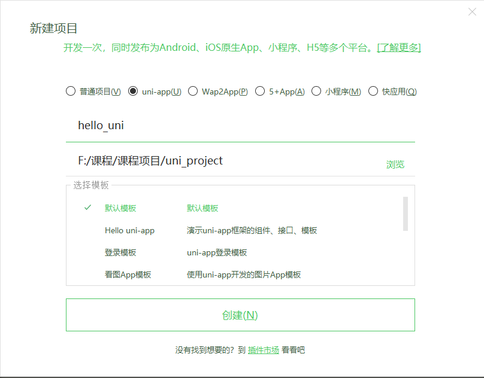

####uni-app的基本使用

课程介绍：

基础部分：

+ 环境搭建
+ 页面外观配置
+ 数据绑定
+ uni-app的生命周期
+ 组件的使用
+ uni-app中样式学习
+ 在uni-app中使用字体图标和开启scss
+ 条件注释跨端兼容
+ uni中的事件
+ 导航跳转
+ 组件创建和通讯，及组件的生命周期
+ uni-app中使用uni-ui库

项目：黑马商城项目

##### uni-app介绍 [官方网页](https://uniapp.dcloud.io/resource)

`uni-app` 是一个使用 [Vue.js](https://vuejs.org/) 开发所有前端应用的框架，开发者编写一套代码，可发布到iOS、Android、H5、以及各种小程序（微信/支付宝/百度/头条/QQ/钉钉）等多个平台。

即使不跨端，`uni-app`同时也是更好的小程序开发框架。

具有vue和微信小程序的开发经验，可快速上手uni-app

为什么要去学习uni-app？

相对开发者来说，减少了学习成本，因为只学会uni-app之后，即可开发出iOS、Android、H5、以及各种小程序的应用，不需要再去学习开发其他应用的框架，相对公司而言，也大大减少了开发成本。

##### 环境搭建

安装编辑器HbuilderX  [下载地址](https://www.dcloud.io/hbuilderx.html)

HBuilderX是通用的前端开发工具，但为`uni-app`做了特别强化。

下载App开发版，可开箱即用

安装微信开发者工具 [下载地址](https://developers.weixin.qq.com/miniprogram/dev/devtools/download.html)

##### 利用HbuilderX初始化项目

+ 点击HbuilderX菜单栏文件>项目>新建

+ 选择uni-app,填写项目名称，项目创建的目录

  

**建议大家直接选 uniapp 里面的看图模板 然后直接按着他的写代码 官网做参考**

1  在pages 创建你的 vue页面后

​    必须需要早pages.json 里面配置路由

2 如果要配置底部标签栏 需要

  pages.json里面的 tabBar 里面的list  配置数组

3 如果需要less  就需要去插件 安装 

4 页面就像写vue 类似  只不过标签 不是 div span  换成了 view  text等等 可以参考官网

大家还是去看看小程序 这个非常像  小程序+vue

**打包怎么做？** **11:05上课**

写完代码

编辑器 上面的  发行 就可以 但是先看看 manifest.json  这个是配置app 安卓和ios的

发行 云打包  之后 可以在 发行 查看 打包状态  

如果打包成功 你就去打开它的下载地址 下载 apk文件就行  安卓的安装包叫apk

在手机 安卓apk  就是 app了

如果要到商店去 就打包的时候发行 这个需要公司的资质的 

有一些大家 真的不清楚的 你可以问问 uni app 客服

**真的用 uniapp  一般就写正常页面  打包完事**

说很多 没意思 大家 今天后 有时间 给我直接 上   看图模板 怼一遍

 

##### 运行项目  开发时候

在菜单栏中点击运行，运行到浏览器，选择浏览器即可运行
**上线  选发行**

在菜单栏中点击**发行**    云打包app

**如果我是vue项目 也想要 打包可以吗？**

可以 用hbuilder x  编辑器就可以 

1 我们开发 vue  然后 npm run build 生成 dist文件夹  里面有html css  js

2 我们先用hbuildx  新建 项目  选择 5+app   创建一个空模板

3 把我们build的 html  css  js  复制到 创建的空模板 

​    你可以 把对应的 js  css  图片 放到的文件夹 或者直接复制粘贴就行

4 打包 --先打开manife.json 配置 然后 在发行 云打包

**这种做法  是不是 就是 html  使用 hbuilderx 给你打包套了一个  壳**

在公司 肯定是要百度的  而且你的6成时间 都在这样

有些同学 百度出来  看不懂？ 没办法 你需要 平时要遇见问题 多去选来看

有些不明白 直接把别人的代码 拿来运行 先看看再说 不要一上来就看文字说明